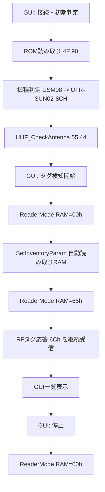

# UTR RFIDタグ検知GUI 制作フィードバック

## 1. 目的

COM10 / 115200bps でPC接続済みのUTR系リーダライタへ接続し、以下をGUIで実行できるプロトタイプを作成した。

- ROMバージョン読み取りによる機種判定
- 機種に応じた利用可能アンテナ確認
- UHFタグ検知結果の一覧表示
- RSSI、ANGLE、PC、EPC/UII、ANT値の表示
- 検知結果のCSV保存

成果物はリポジトリ外の作業環境に配置した。

```text
D:\My documents\Python Scripts\CodeX\utr_tag_gui
```

## 2. 対象環境

| 項目 | 内容 |
|---|---|
| 接続先 | COM10 |
| 通信速度 | 115200bps |
| 実装言語 | Python |
| GUI | Tkinter |
| シリアル通信 | pyserial |
| 実機判定結果 | UTR-SUN02-8CH |
| ROMシリーズ | USM08 |
| ROMバージョン | 2.120 |
| 接続OKアンテナ | ANT1, ANT3 |

## 3. 実装した主要機能

### 3.1 接続・初期判定

起動後に以下の読み取りを行う。

1. ROMバージョン読み取り `4Fh 90h`
2. シリーズ名から機種名を判定
3. 機種別アンテナ数を決定
4. `UHF_CheckAntenna` により各ANTの接続状態を確認

シリーズ判定は `DEVICE_ROM_IDENTIFICATION_AND_SUPPORT.md` の対応表に従った。

| シリーズ | 機種 |
|---|---|
| USM01 | UTR-S201 |
| USM02 | UTR-SUN02-4CH |
| USM05 | UTR-SHR201 |
| USM06 | UTR-SUN02V-8CH |
| USM08 | UTR-SUN02-8CH |

### 3.2 タグ検知

最終的には、公式アプリの動作ログに合わせて、単発 `UHF_Inventory` ではなく連続インベントリ方式へ変更した。

1. リーダライタ動作モードをRAM上でコマンドモードへ戻す
2. 自動読み取りモード用 `UHF_SetInventoryParam` をRAM設定する
3. リーダライタ動作モードをRAM上で `65h: UHF連続インベントリモード` に切り替える
4. 非同期RFタグデータ `CMD=6Ch` を受信し続ける
5. 停止時にリーダライタ動作モードをRAM上でコマンドモードへ戻す

FLASH設定は変更しない。RAMのみを対象とした。

### 3.3 表示項目

| GUI列 | 元データ | 備考 |
|---|---|---|
| 時刻 | PC側受信時刻 | ミリ秒表示 |
| ANT | RFタグ応答フレームのADR byte | 公式アプリ準拠で10進数の生値を表示 |
| RSSI dBm | `DATA[1..2]` | signed 16bit / 10 |
| ANGLE | `DATA[3]` | `value * 45 / 16` |
| PC | PC+EPC先頭2byte | 実機由来値の外部公開は禁止 |
| EPC/UII | PC以降のEPC/UII | GitHubへ載せる場合はマスク対象 |

## 4. 制作過程で発生した問題と修正

### 4.1 初期実装: 単発Inventoryでタグ未検知

初期実装では `UHF_Inventory(55h 10h)` を周期実行した。

結果として、実タグがアンテナ上にあるにもかかわらず、以下の状態が続いた。

```text
Inventory: タグ未検知
```

この時、実機から `source=0x10 code1=0x68` のNACKが返った。GUI側では一旦「タグ未検知」として処理継続するよう修正したが、根本原因は読み取り方式の違いだった。

### 4.2 公式アプリとの差分確認

公式アプリのログでは、タグ検知前に以下の設定を行っていた。

| 順序 | 処理 | コマンド |
|---:|---|---|
| 1 | リーダライタ動作モード読み取り | `4Fh 00h` |
| 2 | ROMバージョン読み取り | `4Fh 90h` |
| 3 | リーダライタ動作モード書き込み | `4Eh` |
| 4 | UHF_GetInventoryParam | `55h 41h` |
| 5 | UHF_SetInventoryParam | `55h 31h` |
| 6 | リーダライタ動作モード書き込み | `4Eh`, mode=`65h` |
| 7 | RFタグデータ受信 | `6Ch` 非同期応答 |

このため、GUIも公式アプリと同じく、連続インベントリモードで非同期 `6Ch` を受ける方式へ変更した。

### 4.3 `ETX不正` の発生

連続インベントリ化後、受信中に `ETX不正` が発生した。

原因は、シリアル受信が任意のチャンク単位で分割されるにもかかわらず、GUI実装が呼び出しごとに受信バッファを破棄していたためである。

修正内容:

- COM接続単位で受信バッファを保持
- `STX` まで再同期
- `LEN + 7` byteが揃うまで待つ
- `ETX/CR` 不正時は1byteずつずらして再同期
- `SUM` 不正フレームは破棄して継続
- 連続受信中の不正フレームでGUIを停止しない

### 4.4 ANT表示の過剰解釈

一時的に、8CH機のRFタグ応答ADRを以下のように分解表示した。

```text
0x40 -> ANT3/外1
```

しかし、公式アプリのANT列はRFタグ応答フレームのADR byteを10進数の生値で表示していた。

公式ログ上の対応:

| RFタグ応答フレーム | 公式アプリANT列 |
|---|---:|
| `02 00 6C ...` | `0` |
| `02 40 6C ...` | `64` |

最終的にGUIも公式アプリ準拠として、ANT列はADR byteの10進数生値を表示する方針に変更した。

## 5. 最終仕様

### 5.1 安全方針

| 項目 | 方針 |
|---|---|
| FLASH書き込み | 実施しない |
| タグメモリ書き込み | 実施しない |
| リーダライタ動作モード変更 | RAMのみ |
| 停止時復帰 | RAM上でコマンドモードへ戻す |
| EPC/UIIログ | GitHubへ生値掲載しない |

### 5.2 タグ検知フロー



### 5.3 パーサ方針

| 分類 | 条件 | 処理 |
|---|---|---|
| ACK | `CMD=30h` | 対象コマンド文脈で処理 |
| NACK | `CMD=31h` | source / codeをログ化 |
| RF_TAG_DATA | `CMD=6Ch`, `DATA[0]=09h` | タグ応答として解析 |
| INVALID_FRAME | `STX/ETX/CR/SUM` 不正 | 破棄して再同期 |
| TIMEOUT | 期限内に有効フレームなし | 連続受信中は待機継続 |

## 6. 検証結果

### 6.1 実機確認

実機で以下を確認した。

- COM10 / 115200bps 接続
- USM08 / UTR-SUN02-8CH / ROM 2.120 判定
- ANT1、ANT3の接続OK表示
- 連続インベントリモードでタグ検知成功
- RSSI、ANGLE、PC、EPC/UII、ANTのGUI表示
- 停止時にRAM上でコマンドモードへ復帰

### 6.2 自動テスト

Pythonテストで以下を確認した。

| テスト観点 | 内容 |
|---|---|
| フレーム生成 | PDF掲載例とSUM一致 |
| ROM応答解析 | USM08等の判定 |
| Inventory応答解析 | RSSI / ANGLE / PC / EPC |
| NACK処理 | Inventory no-tag NACKを停止扱いにしない |
| 分割受信 | 途中フレームを保持 |
| 再同期 | 不正ETX後に次フレームへ復帰 |
| ANT表示 | ADR byteを公式アプリ準拠の10進数で表示 |

最終確認:

```text
8 passed
py_compile OK
```

## 7. RAGへのフィードバック事項

### 7.1 実装時に有効だった情報

| RAG項目 | 有効だった内容 |
|---|---|
| 機種・ROM判定 | USM08 -> UTR-SUN02-8CH |
| UHF_CheckAntenna | 8CH機のANT1..ANT8確認 |
| UHF_Inventory | RFタグ応答 `6Ch`、RSSI、ANGLE、PC+EPC構造 |
| ReaderMode | `65h: UHF連続インベントリモード` |
| SetInventoryParam | 自動読み取りモード用RAM設定 |
| RESPONSE_AND_NACK_MASTER | 複数レスポンス、非同期レスポンス、フレーム分類 |

### 7.2 追加・強化したい情報

| 分類 | 追加したい内容 |
|---|---|
| 公式アプリ互換 | UTRRWManagerのタグ検知前設定シーケンス例 |
| ANT表示 | RFタグ応答ADR byteを公式アプリANT列では10進数生値表示すること |
| 連続インベントリ | `65h`移行後は非同期 `6Ch` を待つ実装パターン |
| シリアル受信 | `LEN+7` の完全フレーム受信、分割受信、再同期処理の実装注意 |
| NACK分類 | `55h 10h` の `code1=0x68` を運用上どう扱うか |
| 実ログ比較 | 公式アプリログと自作実装ログを比較するチェックリスト |

### 7.3 Gitへ載せる際の注意

実機由来のEPC/UII、TID、顧客タグ固有値は公開しない。説明に必要な場合は以下のようにマスクする。

```text
PC=30 00
EPC/UII=<MASKED_EPC_UII>
ANT=0 or 64
RSSI=<RSSI_DBM>
ANGLE=<ANGLE_DEG>
```

## 8. 今後の改善候補

| 優先度 | 改善案 | 理由 |
|---:|---|---|
| 1 | 起動時スナップショットをGUIに表示 | ReaderMode、InventoryParam、外部アンテナ設定の見える化 |
| 2 | 公式アプリ互換ログ出力 | TX/RX比較と現場デバッグを容易にする |
| 3 | ANT表示モード切替 | raw decimal / hex / 推定ラベルを切り替え可能にする |
| 4 | 設定復帰の明示確認 | 停止時のコマンドモード復帰を読戻し確認する |
| 5 | エラーコード辞書拡充 | NACKの意味をGUI上で正確に表示する |

## 9. 結論

今回のプロトタイプでは、単発Inventoryではなく、公式アプリと同じ連続インベントリモードを用いる必要があることが実機ログから確認された。

また、RAGのコマンド仕様だけでなく、公式アプリの実運用シーケンス、非同期受信、シリアルフレーム再同期、ANT列の表示仕様まで含めて実装することで、実機でタグ検知できるGUIになった。

今後RAGへ反映する場合は、コマンド単体の説明に加えて「公式アプリ互換の読み取りシーケンス」と「実装時の受信バッファ設計」を明示すると、同種GUIやCLI実装の再現性が上がる。
